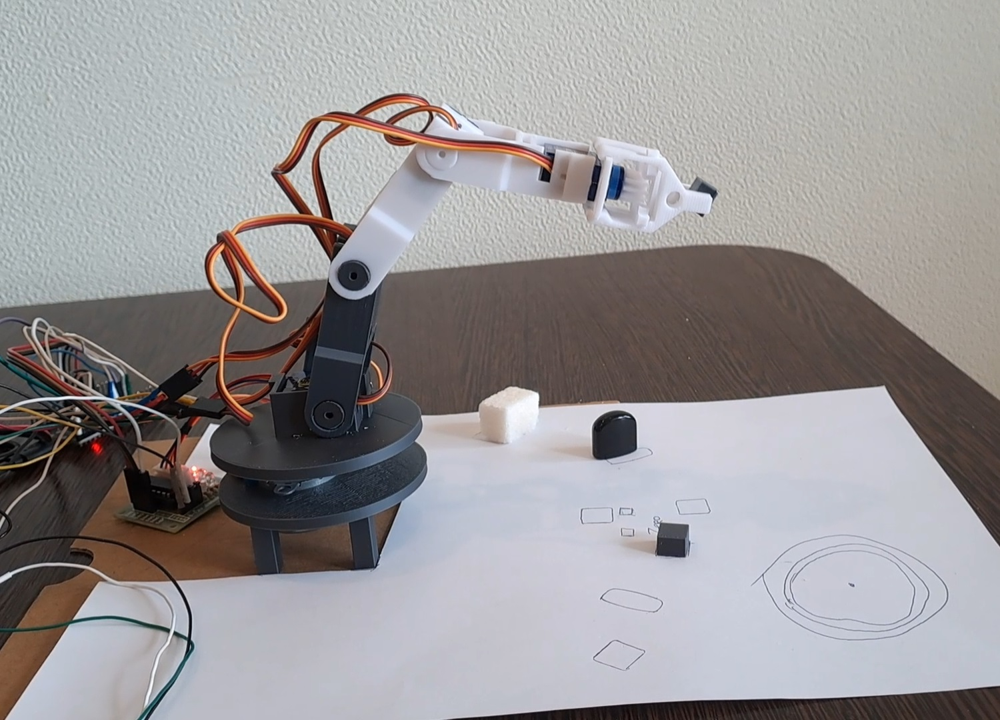

# Промышленный робот манипулятор на ESP32




В основе промышленного робота лежит микроконтроллер ESP32.
Робот подключается по Wi-Fi к локальной сети.  


Модуль может работать в режимах:
- точки доступа (AP);
- станции (STA).

В режиме точки доступа (AP) устройство имеет следующий адрес:
- ip-адрес: 192.168.1.1
- шлюз: 192.168.1.1
- маска сети: 255.255.255.0

Web-сервер работает на порту 80.

```
// SSID и пароль хранятся во внешнем файле password.ino в переменных:
// for AP 
const char* ssid_AP = "********";  
const char* password_AP = "********";
// for STA
const char* ssid = "********";  
const char* password = "********";
```

- Написан на языке C++ Arduino

Статус проекта: Разрабатывается.


Copyright (c) 2024 Evgeny Goryachev  
Gor.Com 